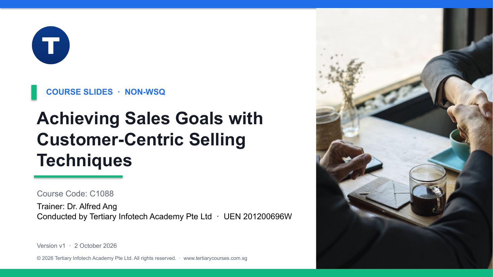

# Achieving Sales Goals with Customer-Centric Selling Techniques

A two-day, role-play-driven sales course that teaches you to win and close deals by understanding the buyer first — from discovery and tailored demos to ethical closing and empathy-first objection handling.

| Course detail | Information |
|---|---|
| Course code | `C1088` |
| Programme | Non-WSQ |
| Duration | 2 days · 15 hours (9:30am – 5:30pm, 7.5 instructional hours per day) |
| Registration | **[View course details and register](https://www.tertiarycourses.com.sg/achieving-sales-goals-with-customer-centric-selling-techniques.html)** |
| Training provider | Tertiary Infotech Academy Pte Ltd (UEN 201200696W) |

> **Nobody wants to be sold. Everybody wants to make a decision that feels easy and safe.**

## About the course

Selling works best as a human conversation. This course builds a confident, customer-centric
selling mindset and then turns it into practical technique: discovery questioning that uncovers
the real need, problem-led demos, well-timed upselling and cross-selling, ethical closes that
respect the buyer, and a calm, structured way to handle objections and rejections. Each of the
four Learning Units ends with an in-class role play built on a realistic Singapore sales
scenario, so every technique is rehearsed, not just discussed.

## Learning outcomes

- **LO1** — Develop recommendation guidelines based on customer preferences and needs.
- **LO2** — Develop upselling and cross-selling techniques to enhance sales closure.
- **LO3** — Develop sales follow-up processes to improve customer engagement.
- **LO4** — Develop evaluation metrics for the sales closure process to measure performance.

## Topics covered

| Learning Unit | Title | Covers |
|---|---|---|
| **LU1** | Foundations of Selling | Selling mindset · Empathy as a sales skill · Sales strategy · Buyer psychology · Discovery process |
| **LU2** | Selling Techniques & Problem-Solving | Problem-based selling · Running a great demo · Upselling & cross-selling · Personalisation · Champion selling |
| **LU3** | Closing the Sale | What a close really is · Closing techniques · Justifying the price · Making it easy to buy · Proper follow-up |
| **LU4** | Handling Objections & Rejections | Objection vs deflection vs rejection · Objection-handling framework · Composure under pressure · Testimonials & social proof · Sales closure metrics |

## Activities

Four in-class role plays — one per Learning Unit. Each folder holds a Facilitator Guide, a
Learner Worksheet and a Checklist (DOCX and PDF). See the [activities overview](activities/README.md)
and the [frameworks used](activities/tools.md).

| # | Activity | Scenario |
|---|---|---|
| 1 | [Role Play: Foundations of Selling](<activities/01 - Role Play: Foundations of Selling/>) | Sunrise Builders — project-management SaaS for a construction PM |
| 2 | [Role Play: Selling Techniques & Problem-Solving](<activities/02 - Role Play: Selling Techniques & Problem-Solving/>) | Northlight Retail — a CRM demo for a marketing director |
| 3 | [Role Play: Closing the Sale](<activities/03 - Role Play: Closing the Sale/>) | Harbourfront Living — closing marketing automation without discounting |
| 4 | [Role Play: Handling Objections & Rejections](<activities/04 - Role Play: Handling Objections & Rejections/>) | A Bukit Timah homeowner — objections on a home security system |

## Courseware

- [Trainer Slides (PPTX)](<courseware/Achieving Sales Goals with Customer-Centric Selling Techniques.pptx>) · [PDF](<courseware/Achieving Sales Goals with Customer-Centric Selling Techniques.pdf>)
- [Learner Guide (DOCX)](<courseware/LG-Achieving Sales Goals with Customer-Centric Selling Techniques.docx>) · [PDF](<courseware/LG-Achieving Sales Goals with Customer-Centric Selling Techniques.pdf>)
- [Lesson Plan (DOCX)](<courseware/LP-Achieving Sales Goals with Customer-Centric Selling Techniques.docx>) · [PDF](<courseware/LP-Achieving Sales Goals with Customer-Centric Selling Techniques.pdf>)
- [Activities](activities/README.md)

Step-by-step facilitation lives in the Learner Guide and the activity folders — never on the slides.

## Distribution boundary

This repository publishes the learner- and trainer-facing courseware only. Every sales scenario
is a fictional training scenario, not a real transaction, company or person; named frameworks
(SPIN Selling, Cialdini's principles of influence, Feel-Felt-Found, Doug Noll's affect labelling)
are real and cited where they are taught, and numeric benchmarks used for colour are labelled
illustrative.

## Official links

- [Course page and registration](https://www.tertiarycourses.com.sg/achieving-sales-goals-with-customer-centric-selling-techniques.html)
- Enquiries: enquiry@tertiaryinfotech.com · +65 6100 0613

---

© 2026 Tertiary Infotech Academy Pte Ltd (UEN 201200696W). Course materials are provided for
enrolled learners and appointed trainers.
